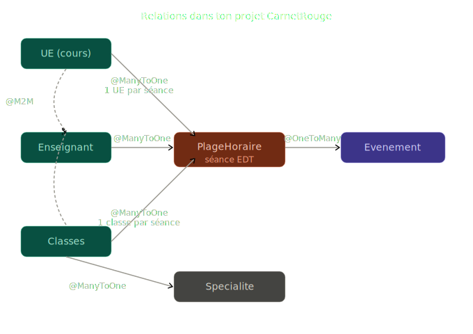

Voici un cours complet sur les relations JPA !Voici un cours complet sur les relations JPA !

## Les relations en JPA — comment les identifier



La clé pour identifier une relation est de poser la question dans **les deux sens**. Prenons des exemples concrets de ton projet.---

## La méthode des 2 questions

Pour chaque relation entre A et B, pose toujours ces deux questions :

**Question 1** → "Un A peut-il avoir plusieurs B ?"
**Question 2** → "Un B peut-il avoir plusieurs A ?"

| Q1 | Q2 | Relation | Annotation |
|----|----|----------|------------|
| Non | Non | Un-à-un | `@OneToOne` |
| Oui | Non | Un-à-plusieurs | `@OneToMany` / `@ManyToOne` |
| Non | Oui | Plusieurs-à-un | `@ManyToOne` |
| Oui | Oui | Plusieurs-à-plusieurs | `@ManyToMany` |

---

## Appliqué à ton projet---


## Le cas `@ManyToMany` — la table intermédiaire

C'est le plus piégeux. Quand tu as `@ManyToMany`, JPA crée automatiquement une **table intermédiaire** en base. Exemple avec `UE` et `Enseignant` :

```
Table UE         Table ue_enseignant    Table Enseignant
┌────┐           ┌────────┬────────┐    ┌────┐
│ id │←──────────│ ue_id  │ ens_id │───→│ id │
└────┘           └────────┴────────┘    └────┘
```

**Côté propriétaire** (celui qui déclare `@JoinTable`) :
```java
// Dans UE.java — côté propriétaire
@ManyToMany
@JoinTable(
    name = "ue_enseignant",
    joinColumns = @JoinColumn(name = "ue_id"),
    inverseJoinColumns = @JoinColumn(name = "enseignant_id")
)
private Collection<Enseignant> enseignants;
```

**Côté inverse** (l'autre entité, utilise `mappedBy`) :
```java
// Dans Enseignant.java — côté inverse
@ManyToMany(mappedBy = "enseignants")
private Collection<UE> ues;
```

> La règle : **un seul côté déclare `@JoinTable`**, l'autre utilise `mappedBy` — sinon JPA crée deux tables intermédiaires !

---

## Résumé visuel rapide

| Relation | Annotation côté A | Annotation côté B | Table intermédiaire ? |
|----------|-------------------|-------------------|-----------------------|
| 1 département → N enseignants | `@OneToMany` | `@ManyToOne` | Non |
| 1 enseignant → 1 profil | `@OneToOne` | `@OneToOne` | Non |
| N UE ↔ N enseignants | `@ManyToMany` + `@JoinTable` | `@ManyToMany(mappedBy)` | Oui |

Oui ! Et c'est exactement la bonne question à se poser. Appliquons la méthode des 2 questions :

---

**Question 1** → "Une PlageHoraire peut-elle concerner plusieurs cours (UE) ?"
> **Oui** — Ex: le lundi 8h-10h, on peut avoir Algorithmique en salle A ET Réseaux en salle B (pour deux classes différentes)

**Question 2** → "Un cours (UE) peut-il avoir plusieurs PlageHoraires ?"
> **Oui** — Ex: Algorithmique peut être programmé lundi 8h-10h ET jeudi 14h-16h

---

## Conclusion → `@ManyToMany`

Donc la relation entre `PlageHoraire` et `UE` est bien **ManyToMany**, comme tu l'avais dans ton modèle initial. Ce que j'avais proposé avec `@ManyToOne` était **faux** — je corrige :

```java
// Dans PlageHoraire.java ✅
@ManyToMany
@JoinTable(
    name = "plage_horaire_ue",
    joinColumns = @JoinColumn(name = "plage_horaire_id"),
    inverseJoinColumns = @JoinColumn(name = "ue_id")
)
private Collection<UE> ues = new ArrayList<>();

// Dans UE.java ✅
@ManyToMany(mappedBy = "ues")
private Collection<PlageHoraire> plagesHoraires = new ArrayList<>();
```

---

Même raisonnement pour `Enseignant` et `Classes` :

| Relation | Q1 | Q2 | Résultat |
|----------|----|----|----------|
| PlageHoraire ↔ UE | Oui | Oui | `@ManyToMany` |
| PlageHoraire ↔ Enseignant | Oui | Oui | `@ManyToMany` |
| PlageHoraire ↔ Classes | Oui | Oui | `@ManyToMany` |

> Une même séance horaire peut concerner plusieurs classes, plusieurs enseignants et plusieurs UE — et vice versa.

On refait le modèle complet corrigé ? 🎯 🎯

Voici le modèle complet corrigé :

## `PlageHoraire.java`

```java
package CarnetRouge.CarnetRouge.GDU.Entity;

import CarnetRouge.CarnetRouge.GDAE.Entity.UE;
import CarnetRouge.CarnetRouge.GDET.Entity.Classes;
import CarnetRouge.CarnetRouge.GDET.Entity.Evenement;
import jakarta.persistence.*;
import lombok.*;
import org.springframework.data.annotation.CreatedDate;
import org.springframework.data.annotation.LastModifiedDate;
import org.springframework.data.jpa.domain.support.AuditingEntityListener;

import java.time.LocalDate;
import java.time.LocalDateTime;
import java.time.LocalTime;
import java.util.ArrayList;
import java.util.Collection;

@Entity
@Getter
@Setter
@AllArgsConstructor
@NoArgsConstructor
@Builder
@EntityListeners(AuditingEntityListener.class)
public class PlageHoraire {
    @Id
    @GeneratedValue(strategy = GenerationType.IDENTITY)
    private Long id;

    private LocalDate jour;
    private LocalTime heureDebut;
    private LocalTime heureFin;

    @CreatedDate
    @Column(updatable = false, nullable = false)
    private LocalDateTime createdAt;

    @LastModifiedDate
    private LocalDateTime updatedAt;

    // ✅ Une plage peut concerner plusieurs UE
    @ManyToMany
    @JoinTable(
            name = "plage_horaire_ue",
            joinColumns = @JoinColumn(name = "plage_horaire_id"),
            inverseJoinColumns = @JoinColumn(name = "ue_id")
    )
    private Collection<UE> ues = new ArrayList<>();

    // ✅ Une plage peut concerner plusieurs enseignants
    @ManyToMany
    @JoinTable(
            name = "plage_horaire_enseignant",
            joinColumns = @JoinColumn(name = "plage_horaire_id"),
            inverseJoinColumns = @JoinColumn(name = "enseignant_id")
    )
    private Collection<Enseignant> enseignants = new ArrayList<>();

    // ✅ Une plage peut concerner plusieurs classes
    @ManyToMany
    @JoinTable(
            name = "plage_horaire_classe",
            joinColumns = @JoinColumn(name = "plage_horaire_id"),
            inverseJoinColumns = @JoinColumn(name = "classe_id")
    )
    private Collection<Classes> classes = new ArrayList<>();

    // ✅ Une plage peut avoir plusieurs événements
    @OneToMany(mappedBy = "plageHoraire", cascade = CascadeType.ALL, orphanRemoval = true)
    private Collection<Evenement> evenements = new ArrayList<>();
}
```

---

## `UE.java`

```java
package CarnetRouge.CarnetRouge.GDU.Entity;

import CarnetRouge.CarnetRouge.GDET.Entity.Classes;
import jakarta.persistence.*;
import lombok.*;
import org.springframework.data.annotation.CreatedDate;
import org.springframework.data.annotation.LastModifiedDate;
import org.springframework.data.jpa.domain.support.AuditingEntityListener;

import java.time.LocalDateTime;
import java.util.ArrayList;
import java.util.Collection;

@Entity
@Getter
@Setter
@AllArgsConstructor
@NoArgsConstructor
@Builder
@EntityListeners(AuditingEntityListener.class)
public class UE {
    @Id
    @GeneratedValue(strategy = GenerationType.IDENTITY)
    private Long id;

    private String nom;
    private String code;
    private String libelle;
    private Long nbrCredit;
    private Long dheure;

    @CreatedDate
    @Column(updatable = false, nullable = false)
    private LocalDateTime createdAt;

    @LastModifiedDate
    private LocalDateTime updatedAt;

    // ✅ Côté inverse de PlageHoraire
    @ManyToMany(mappedBy = "ues")
    private Collection<CarnetRouge.CarnetRouge.GDET.Entity.PlageHoraire> plagesHoraires = new ArrayList<>();

    // ✅ Côté propriétaire — une UE peut être enseignée par plusieurs enseignants
    @ManyToMany
    @JoinTable(
            name = "ue_enseignant",
            joinColumns = @JoinColumn(name = "ue_id"),
            inverseJoinColumns = @JoinColumn(name = "enseignant_id")
    )
    private Collection<Enseignant> enseignants = new ArrayList<>();

    // ✅ Côté inverse de Classes
    @ManyToMany(mappedBy = "ue")
    private Collection<Classes> classes = new ArrayList<>();
}
```

---

## `Evenement.java`

```java
package CarnetRouge.CarnetRouge.GDU.Entity;

import jakarta.persistence.*;
import lombok.*;
import org.springframework.data.annotation.CreatedDate;
import org.springframework.data.annotation.LastModifiedDate;
import org.springframework.data.jpa.domain.support.AuditingEntityListener;

import java.time.LocalDateTime;

@Entity
@Getter
@Setter
@AllArgsConstructor
@NoArgsConstructor
@Builder
@EntityListeners(AuditingEntityListener.class)
public class Evenement {
    @Id
    @GeneratedValue(strategy = GenerationType.IDENTITY)
    private Long id;

    private String nom;
    private String description;
    private String couleur; // ✅ pour FullCalendar

    @CreatedDate
    @Column(updatable = false, nullable = false)
    private LocalDateTime createdAt;

    @LastModifiedDate
    private LocalDateTime updatedAt;

    // ✅ ManyToOne — plusieurs événements peuvent être dans la même plage
    @ManyToOne
    @JoinColumn(name = "plage_horaire_id")
    private CarnetRouge.CarnetRouge.GDET.Entity.PlageHoraire plageHoraire;
}
```

---

## `Classes.java`

```java
package CarnetRouge.CarnetRouge.GDU.Entity;

import CarnetRouge.CarnetRouge.GDAE.Entity.Specialite;
import CarnetRouge.CarnetRouge.GDAE.Entity.UE;
import jakarta.persistence.*;
import lombok.*;
import org.springframework.data.annotation.CreatedDate;
import org.springframework.data.annotation.LastModifiedDate;
import org.springframework.data.jpa.domain.support.AuditingEntityListener;

import java.time.LocalDateTime;
import java.util.ArrayList;
import java.util.Collection;

@Entity
@Getter
@Setter
@AllArgsConstructor
@NoArgsConstructor
@Builder
@EntityListeners(AuditingEntityListener.class)
public class Classes {
    @Id
    @GeneratedValue(strategy = GenerationType.IDENTITY)
    private Long id;

    private String nom;

    @CreatedDate
    @Column(updatable = false, nullable = false)
    private LocalDateTime createdAt;

    @LastModifiedDate
    private LocalDateTime updatedAt;

    // ✅ Côté propriétaire
    @ManyToMany
    @JoinTable(
            name = "classes_ue",
            joinColumns = @JoinColumn(name = "classes_id"),
            inverseJoinColumns = @JoinColumn(name = "ue_id")
    )
    private Collection<UE> ue = new ArrayList<>();

    // ✅ Côté inverse de PlageHoraire
    @ManyToMany(mappedBy = "classes")
    private Collection<CarnetRouge.CarnetRouge.GDET.Entity.PlageHoraire> plagesHoraires = new ArrayList<>();

    @ManyToOne
    @JoinColumn(name = "specialite_id")
    private Specialite specialite;
}
```

---

## Récapitulatif des tables créées en base

```
plage_horaire          → table principale
plage_horaire_ue       → liaison PlageHoraire ↔ UE
plage_horaire_enseignant → liaison PlageHoraire ↔ Enseignant
plage_horaire_classe   → liaison PlageHoraire ↔ Classes
ue_enseignant          → liaison UE ↔ Enseignant
classes_ue             → liaison Classes ↔ UE
```

Voici la description littérale de chaque ligne :

---

## `@ManyToOne` — Classes

```java
@ManyToOne
@JoinColumn(name = "classe_id")
private Classes classe;
```
> **"Plusieurs PlageHoraires peuvent appartenir à une seule Classes"**
> Autrement dit : la classe L3 peut avoir **lundi 8h-10h**, **lundi 10h-12h**, **mardi 8h-10h**... toutes ces séances pointent vers **la même classe L3**.
> En base : la table `plage_horaire` aura une colonne `classe_id` qui stocke l'id de la classe.

---

## `@ManyToOne` — UE

```java
@ManyToOne
@JoinColumn(name = "ue_id")
private UE ue;
```
> **"Plusieurs PlageHoraires peuvent concerner une seule UE"**
> Autrement dit : le cours Algorithmique peut apparaître **lundi 8h-10h**, **jeudi 14h-16h**... toutes ces séances pointent vers **le même cours Algorithmique**.
> En base : la table `plage_horaire` aura une colonne `ue_id`.

---

## `@ManyToOne` — Enseignant

```java
@ManyToOne
@JoinColumn(name = "enseignant_id")
private Enseignant enseignant;
```
> **"Plusieurs PlageHoraires peuvent être assurées par un seul Enseignant"**
> Autrement dit : le Prof. Kamga peut enseigner **lundi 8h-10h** ET **jeudi 14h-16h**... toutes ces séances pointent vers **le même Prof. Kamga**.
> En base : la table `plage_horaire` aura une colonne `enseignant_id`.

---

## `@OneToMany` — Evenements

```java
@OneToMany(mappedBy = "plageHoraire", cascade = CascadeType.ALL, orphanRemoval = true)
private Collection<Evenement> evenements = new ArrayList<>();
```
> **"Une seule PlageHoraire peut avoir plusieurs Evenements"**
> Autrement dit : la séance du lundi 8h-10h peut avoir un événement "Contrôle surprise" ET un événement "Visite du directeur"...
> `mappedBy = "plageHoraire"` → c'est **Evenement** qui détient la clé étrangère, pas PlageHoraire.
> `cascade = ALL` → si on supprime la séance, ses événements sont supprimés aussi.
> `orphanRemoval` → si on retire un événement de la liste, il est supprimé de la base.

---

## Résumé visuel en base de données

```
Table plage_horaire
┌─────┬────────────┬────────────┬──────────┬──────────────┬────────────────┐
│ id  │    jour    │ heureDebut │ heureFin │  classe_id   │ enseignant_id  │  ue_id  
├─────┼────────────┼────────────┼──────────┼──────────────┼────────────────┤
│  1  │ 2026-03-16 │  08:00     │  10:00   │      3       │       2        │    5
│  2  │ 2026-03-16 │  10:00     │  12:00   │      3       │       7        │    8
│  3  │ 2026-03-17 │  08:00     │  10:00   │      3       │       2        │    5
└─────┴────────────┴────────────┴──────────┴──────────────┴────────────────┘
                                               ↑                ↑            ↑
                                           FK vers          FK vers       FK vers
                                           Classes         Enseignant       UE
```

Voici un exemple très concret avec des vraies données :

---

## Emploi du temps — Classe L3 Informatique, semaine du 16 mars 2026

```
Table plage_horaire
┌────┬────────────┬───────────┬──────────┬───────┬─────────────────────┬─────────────────┬──────────────┐
│ id │    jour    │ heureDebut│ heureFin │ salle │      classe         │   enseignant    │      ue      │
├────┼────────────┼───────────┼──────────┼───────┼─────────────────────┼─────────────────┼──────────────┤
│  1 │ 2026-03-16 │  08:00    │  10:00   │ A101  │ L3 Informatique (3) │ Kamga Paul  (2) │ Algo     (5) │
│  2 │ 2026-03-16 │  10:00    │  12:00   │ B205  │ L3 Informatique (3) │ Nkomo Alice (7) │ Réseaux  (8) │
│  3 │ 2026-03-16 │  14:00    │  16:00   │ A101  │ L3 Informatique (3) │ Biya Marc   (4) │ BDD      (6) │
│  4 │ 2026-03-17 │  08:00    │  10:00   │ C310  │ L3 Informatique (3) │ Kamga Paul  (2) │ Algo     (5) │
│  5 │ 2026-03-16 │  08:00    │  10:00   │ D102  │ L2 Informatique (2) │ Fouda Claire(9) │ Maths    (3) │
└────┴────────────┴───────────┴──────────┴───────┴─────────────────────┴─────────────────┴──────────────┘
```

---

## Ce que ça démontre

**Ligne 1 et 4** — même UE (Algo), même enseignant (Kamga), même classe (L3)
> → Algorithmique est programmé **2 fois dans la semaine** pour L3. C'est pourquoi UE et Enseignant sont `@ManyToOne` — ils peuvent apparaître dans plusieurs séances.

**Ligne 1 et 5** — même jour, même heure, mais classes différentes
> → L3 a Algo pendant que L2 a Maths. Les deux classes ont leur propre séance indépendante.

**Ligne 1, 2, 3** — même classe (L3), même jour (lundi)
> → C'est l'emploi du temps du **lundi de L3** : Algo le matin, Réseaux à 10h, BDD l'après-midi.

---

## Traduit en objets Java

```java
// Séance id=1 : Lundi matin, Algo, Kamga, L3
PlageHoraire seance1 = PlageHoraire.builder()
    .jour(LocalDate.of(2026, 3, 16))
    .heureDebut(LocalTime.of(8, 0))
    .heureFin(LocalTime.of(10, 0))
    .salle("A101")
    .ue(algorithmique)       // UE id=5
    .enseignant(kamga)       // Enseignant id=2
    .classe(l3Info)          // Classes id=3
    .build();

// Séance id=4 : Mardi matin, même Algo, même Kamga, même L3
PlageHoraire seance4 = PlageHoraire.builder()
    .jour(LocalDate.of(2026, 3, 17))
    .heureDebut(LocalTime.of(8, 0))
    .heureFin(LocalTime.of(10, 0))
    .salle("C310")
    .ue(algorithmique)       // ✅ même UE
    .enseignant(kamga)       // ✅ même enseignant
    .classe(l3Info)          // ✅ même classe
    .build();
```

> Tu vois que `algorithmique`, `kamga` et `l3Info` sont **réutilisés** dans plusieurs séances — c'est exactement ce que `@ManyToOne` représente. 🎯

On passe aux repositories ? 😊